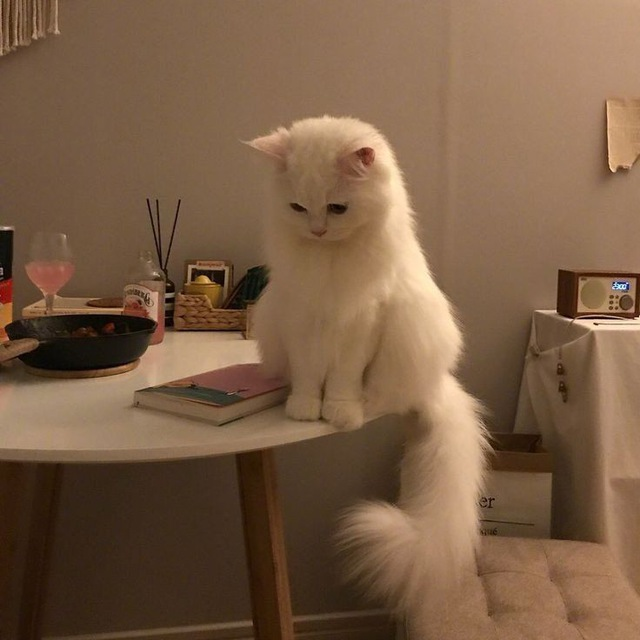

<link rel="stylesheet" href="style.css">

{:#my_pic}

# DARYA YASKO

## C# developer

### EDUCATION

- [MGOL1](http://firstlyceum.by) 2018-2022
- [BRU](http://bru.by) 2022-2026

### ABOUT ME{#identifier .h3}

---

My name is Dasha. I am very good at my job.

### WORK EXPIERIENCE

---

- 0.5 years tech support in online english shcool
- 1 year child teacher in jewish youth program

### SKILLS{#identifier .h3}

---

1. C# 1.5 years
1. C++ 1 year
1. Python 1.5 years
1. HTML 1 week
1. CSS 1 week
1. english level B2
1. ITstep academy 2 years

### REFERENCE

---

You can call my mom. She will tell you I'm the best

### CODE EXAMPLE{#identifier .h3}

---

    'using System.Text.Json;
    Person tom = new Person("Tom", 37);
    string json = JsonSerializer.Serialize(tom);
    Console.WriteLine(json);

    Person? restoredPerson = JsonSerializer.Deserialize&lt;Person&lt;(json);
    Console.WriteLine(restoredPerson?.Name); // Tom

    class Person
    {
        public string Name { get;}
        public int Age { get; set; }
        public Person(string name, int age)
        {
            Name = name;
            Age = age;
        }
    }'

### CONTACTS

---

A1: +375447084688
Life: +375333371184
email: [darya.ya2608@gmail.com](gmail.com)
